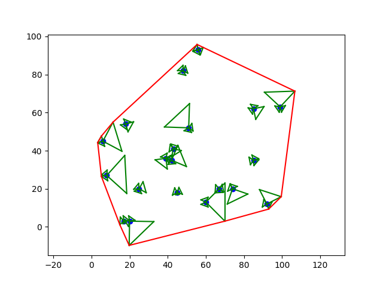

# Tiger Movement Simulation

## Description

This Python script simulates the movement of tigers across a two-dimensional space. Each tiger is represented by a series of points that define its position and movement direction. The script uses linear transformations to rotate and translate these points, simulating the tigers' movements. It then visualizes the paths of these tigers using matplotlib, illustrating their trajectories over time.

## Features

- Simulates multiple tigers moving in a 2D space.
- Uses linear transformations for rotation and translation of points to simulate movement.
- Visualizes the movement paths of tigers and their current positions.
- Identifies the lowest point among all tigers to start the visualization.

## How It Works

### Tiger Class
- Initializes a tiger with a position, direction, and movement parameters.
- Generates points representing the tiger's shape and orientation.
- Moves the tiger by translating its points based on the direction and speed.

### Movement Simulation
- Randomly generates multiple tigers with initial positions.
- Collects all points representing the tigers.
- Finds the lowest point to start the path visualization.
- Draws each tiger and their path using matplotlib.
<pre>
def generate_random_tigers():
    points = np.random.rand(20, 2) * 100
    tigers = []
    for x, y in points:
        tigers.append(Tiger(int(x), int(y)))

    return tigers

def draw_tiger(tiger):
  points = tiger.points
  points.append(tiger.points[0])
  for i in range(len(points) - 1):
      x1, y1 = points[i]
      x2, y2 = points[i + 1]
      plt.plot([x1, x2], [y1, y2], color='green')
</pre>

### Visualization
- Uses matplotlib to plot the positions and paths of tigers.
- Updates the positions of tigers in each iteration to simulate continuous movement.
<pre>
def draw_point(tigers):
    x = []
    y = []
    for tiger in tigers:
        x.append(tiger.x)
        y.append(tiger.y)
    plt.scatter(x, y, color = 'blue')

def draw_line(x1, y1, x2, y2):
    plt.plot([x1, x2], [y1, y2], color='red')
</pre>

### Conclusion
This simulation showcases the basic principles of object-oriented programming, linear transformations, and data visualization in Python. It provides a foundation for more complex simulations involving moving entities and their interactions.

